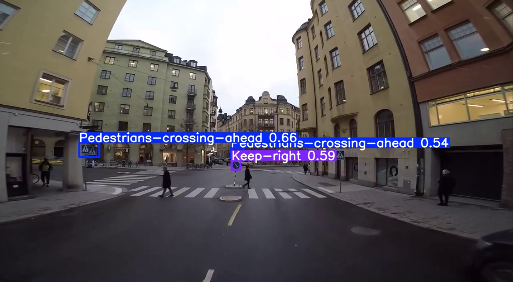

# 🚦 Intelligent Traffic Sign Recognition System

This project is a **Streamlit web application** that uses a trained **YOLOv11** model to detect traffic signs from images, videos, or YouTube links in real time.

---

## 📌 Features
- **Image Upload** → Upload a `.jpg`, `.jpeg`, or `.png` file for detection.
- **Video Upload** → Upload a `.mp4`, `.mov`, or `.avi` file for frame-by-frame detection.
- **YouTube Video** → Provide a YouTube link for direct detection without manual download.
- **YOLOv11 Model** → Uses the `best.pt` file for traffic sign recognition.
- **Custom Confidence & Resolution** → Runs detection with confidence threshold `0.387` and resolution `1280` for maximum accuracy.

---

## 📂 Project Structure
```
.
├── .devcontainer/              # Development container configuration
├── app.py                      # Streamlit application script
├── best.pt                     # Trained YOLOv11 model weights
├── output.png                  # Example detection output image
├── packages.txt                # System packages required
├── requirements.txt            # Python dependencies
├── traffic sign test video.mp4 # Example video for testing
└── README.md                   # Project documentation
```

---

## ⚙️ Installation & Setup

### 1️⃣ Clone the repository
```bash
git clone https://github.com/Bhavesh2618/Traffic_Sign_detection.git
cd Traffic_Sign_detection
```

### 2️⃣ Install dependencies
Install required Python packages:
```bash
pip install -r requirements.txt
```

Install system dependencies (for Linux/Streamlit Cloud):
```bash
sudo apt-get update && sudo apt-get install -y libgl1 libglib2.0-0
```

---

## ▶️ Usage

### Run the application
```bash
streamlit run app.py
```

### Select input source in the sidebar:
- **Upload Image** → Browse and upload an image file.
- **Upload Video** → Upload a video file for detection.
- **YouTube URL** → Paste a YouTube link to run detection.

---

## 📦 Requirements

**`requirements.txt`**
```
streamlit
ultralytics
opencv-python-headless
torch
torchvision
numpy
pillow
```

**`packages.txt`**
```
libgl1
libglib2.0-0
```

---

## 🖼 Example
Example detection on an uploaded image:



---

## 📜 License
This project is licensed under the MIT License - see the [LICENSE](LICENSE) file for details.

---

## ✨ Author
Developed by **Bhavesh Kumar** 🚀
